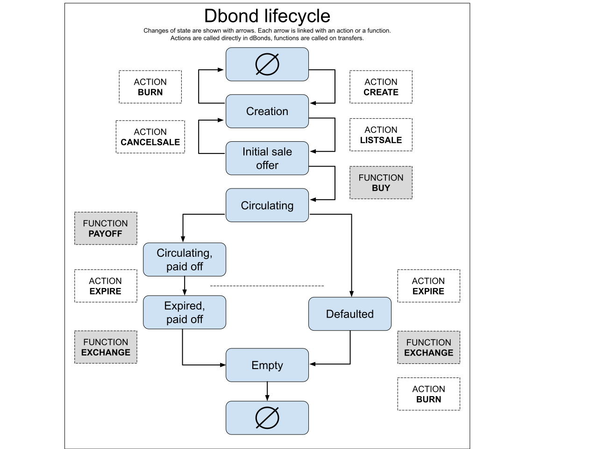

dbonds: Digital Bonds Token Spec v0.1alpha
=====================================

Andrey Perepelitsyn, Maksim Mironov, Oleg Bakatanov

[Depos Foundation](https://depos.io)
    Copyright (C) 2019 DEPOS INC.
    Permission is granted to copy, distribute and/or modify this document
    under the terms of the GNU Free Documentation License, Version 1.3
    or any later version published by the Free Software Foundation;
    with no Invariant Sections, no Front-Cover Texts, and no Back-Cover Texts.
    
Introduction
============

Being inspired by the [dGoods](https://dgoods.org) project we decided to create dBonds standard. dBonds 
is an open source and free standard for creating virtual debt instruments which 
may or may not have collateral inside and can represent a traditional 
(not collateralized bond); a bond, collateralized by an off-chain asset (e.g. real 
fiat-nominated bond), or a bond collateralized by on-chain collateral locked in dbond smart contract.
Here is no liquidation/margin call protocol of any kind and it is built on other incentives.
To read more information about the product side of dBonds please visit our page
[dBonds.org](https://dBonds.org) or a [Medium](https://medium.com/dbonds) page.

Standard consist of smart contract dBonds which helps managing operations with 
dbond tokens isuued under dBonds contract.
We tried to make this standard in the most flexible and intuitive way, though we
welcome any questions, discussions and advises on how to make it better.

---

At this moment only non-fungible dBonds tokens are supported. That means you can 
buy only the whole debt.

In DEX now you can only sale the dbond initial offer. You can not list a buy-side
offer.

---

dBond structure
===============
Here we show how dBond token is organized and what information has to be provided.

**dBond** has the following structure:
```c++
struct dbond {
  dbond_id_class        name;                    // unique name for dbond
  name                  emitent;                 // account who initiates an issue
  asset                 max_supply;              //
  int                   collateral_type;         // how is collaterized
  extended_asset        crypto_collateral;       // in case collateral_type is CRYPTO_ASSET, 
                                                 // this field stores asset
  extended_asset        issue_price;             // unit of account, currency serves as price ex. DUSD
  time_point            maturity_time;           // time until when to be paid off by emitent
  extended_asset        payoff_price;            // price and currency for pay off (face value)
  bool                  fungible;                // if fungible or not
  int                   early_payoff_policy;     // if available, how is organized
  fiat_bond             collateral_bond;         // if collateral_type != FIAT_BOND then empty
  string                additional_info;
};

struct fiat_bond {
  string ISIN;                                   // main and unique id of fiat bond
  string name;                                   // name of the fiat bond (meaningful, any of choice)
  string currency;                               // currency of fiat bond
  string country;                                // country where issued
  string bond_description_webpage;               // reference for the full fiat bond specification
  string proof_of_ownership                      // info/link for the proof of ownership
};


enum dbond_state: uint8_t {
  CREATION = 0,                     // set dbond configuration. dbond can be modified
  INITIAL_SALE_OFFER = 1,           // can be bought on built-in DEX. Only issue_price can be changed
  CIRCULATING = 2,                  // is sold, dbond fields are fixed, is traded on secondary market
  CIRCULATING_PAIDOFF = 3,         // issuer paid off the dbond, received collateral back
                                    // current_time <= maturity time, hence, not expired
                                    
  EXPIRED_PAIDOFF = 4,             // issuer paid off the dbond, current_time > maturity_time
  DEFAULTED = 5,                    // issuer haven't paid of the dbond, current_time > maturity_time
  EMPTY = 6,                        // if there was a collateral or paid off asset, it was exchanged
                                    // in favor of dbond holder
};


enum collateral_type: uint8_t {
  CRYPTO_ASSET = 0,
  FIAT_BOND = 1,
  NONE = 2,
};


enum class early_payoff_policy: int {
  FULL_INTEREST_RATE = 0,
  TIME_LINEAR_INTEREST_RATE = 1,          // not supported yet
  First = FULL_INTEREST_RATE,
  Last = TIME_LINEAR_INTEREST_RATE
};
```


Following actions are used with a direct call of smart contract
===============================================================
**TRANSFER**: standard transfer method

```c++
ACTION transfer(name from, name to, asset quantity, const string& memo);
```


**CREATE**: this action creates an instance of the bond with respect to specification
provided wraped up in bond instance.

```c++
ACTION create(name from, dbond bond);
```


**CHANGE**: Only dbond emitent can call this action.
With this action created or listed dbond can be updated. Please note,
most changes are restricted once dbond is listed for a sale.

```c++
ACTION change(name from, dbond_id_class dbond_id);
```


**BURN**: Can be called either at the beginning (by emitent) 
or at very end (by holder) of dbond lifecycle. Burns dbond token such that it never
existed.

```c++
ACTION burn(name from, dbond_id_class dbond_id);
```


**LISTSALE**: This action is called by emitent for listing a sale of the token
in the dBonds contract.

```c++
ACTION listsale(name from, dbond_id_class dbond_id);
```


**CANCELSALE**: Called by emitent, canceles the listed dbond offer if not sold.

```c++
ACTION cancelsale(name from, dbond_id_class dbond_id);
```


**EXPIRE**: When is called, time is checked and if current time exceeds 
the maturity time, then dbond goes through state change. Can be called by anyone.

```c++
ACTION expire(dbond_id_class dbond_id);
```


Next functions are called indirectly and automatically on transfers with appropriate memos
==========================================================================================
Here are memos to use

```c++
struct MEMOS {
    const string put_collateral = "put collateral "; // + bond.bond_name
    const string buy_bond = "buy bond ";             // + bond.bond_name
    const string payoff_bond = "pay off bond ";      // + bond.bond_name
    const string exchange = "exchange";
  } memos;
```

**SENDINTOBOND**: If created dbond requires crypto collateral, dbond emitent must 
put it inside before listing a sale by transfering collateral to the smart contract.

```c++
void sendintobond(name from, extended_asset collateral, dbond_id_class dbond_id);
```


**BUY**: Function for buying already listed dbond offer.

```c++
void buy(name buyer, dbond_id_class dbond_id, extended_asset price);
```


**PAYOFF**: Usually is called on transfer from emitent (but generally from anyone) in order 
to pay off the dbond with the claimed price and asset. It has to be done before 
expiration date otherwise dbond is claimed defaulted.

```c++
void payoff(name from, dbond_id_class dbond_id, extended_asset for_payoff);
```


**EXCHANGE**: If there is any asset behind the dbond (either collateral or the
paid off asset) it is exchanged for dbond token in favor of dbond holder.
Can be called only when dbond is paid off or defaulted.

```c++
void exchange(name from, dbond_id_class dbond_id);
```


